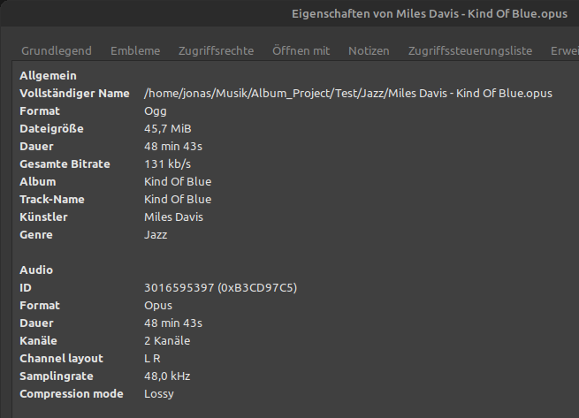

# Full Album Indexer

Have you ever seen those Full Albums on YouTube? When you download them, the files lack proper artist tags and music categories, making them poorly integrated into your music player.

This program solves that by indexing full album music files and setting proper music tags.

## What It Does

Music players need metadata to index files by band, genre, and year of publication. This tool automatically extracts and sets this information.

### Example

Input file:
```
.../Album/ElectronicMusic/Gorillaz - Cracker Island (Full Album) 2023.opus
```

The program will automatically set:
- Artist name: Gorillaz
- Title name: Cracker Island
- Release year: 2023
- Genre: ElectronicMusic
- Clean filename: Gorillaz - Cracker Island.opus

### Special Character Handling

The program also cleans up filenames with special characters:

Example 1:
```
Input:  R̲o̲b̲b̲i̲e̲ William̲s̲ - L-i-f-e̲ T̲h̲r̲u̲ A̲ L̲e̲n̲s̲
Output: Robbie Williams - Life Thru A Lens
```

Example 2:
```
Input:  B̤ṳf̤f̤a̤l̤o̤ ̤V̤o̤l̤c̤a̤n̤i̤c̤ ̤- R̤o̤c̤k̤ 1973.opus
Output: Buffalo Volcanic - Rock
```
(The year 1973 is removed from the filename but added to the metadata)

## Installation

1. Make sure you have Python 3.6 or higher installed:
```bash
python3 --version
```

2. Clone this repository:
```bash
git clone https://github.com/yourusername/FullAlbumIndexer.git
cd FullAlbumIndexer
```

3. Install the required dependencies:
```bash
pip install -r requirements.txt
```

## Usage

The program can be run using the following commands:

### Basic Usage
Process a single folder:
```bash
python3 main.py /path/to/music/folder
```

### Advanced Options

Process recursively with verbose output:
```bash
python3 main.py -rv /path/to/music/folder
```

Preview changes without modifying files (dry-run):
```bash
python3 main.py --dry-run /path/to/music/folder
```

Full example with all options:
```bash
python3 main.py -rv --dry-run /path/to/music/folder
```

### Command Line Options

- `folder_path`: Path to the folder containing music files (required)
- `-r, --recursive`: Process folders recursively
- `-v, --verbose`: Show detailed processing information
- `--dry-run`: Show what would be done without making changes





