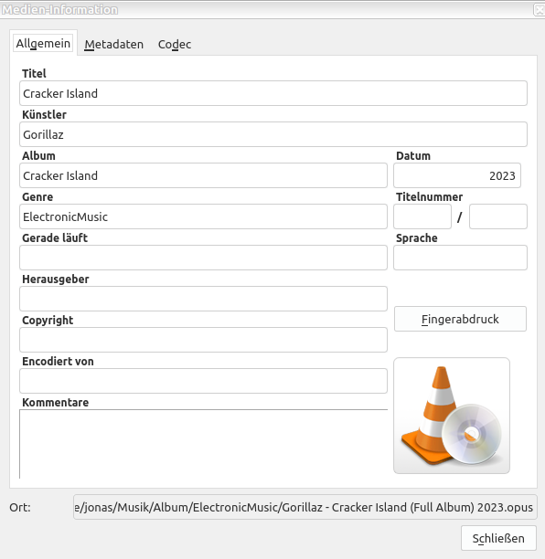

#### This programs indexes full album music files and sets music tags for these files.
#### You add the main path of your music folder and this programs iterates over all files.
#### Music Player need this music file metadata to index the files by band,genre,year of publication
##### Example single file:

"/home/jonas/Musik/Album/ElectronicMusic/Gorillaz - Cracker Island (Full Album) 2023.opus"

Generates the following information from the file name and path:

Artist name: Gorillaz

Title name: Cracker Island

Release year: 2023

Clean file name:clean_file_name: Gorillaz - Cracker Island.opus

Genre: ElectronicMusic

 

This information is than saved to the file as music information.

 

